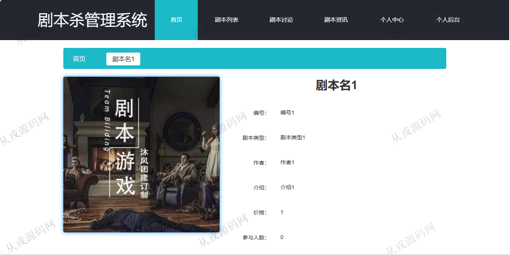
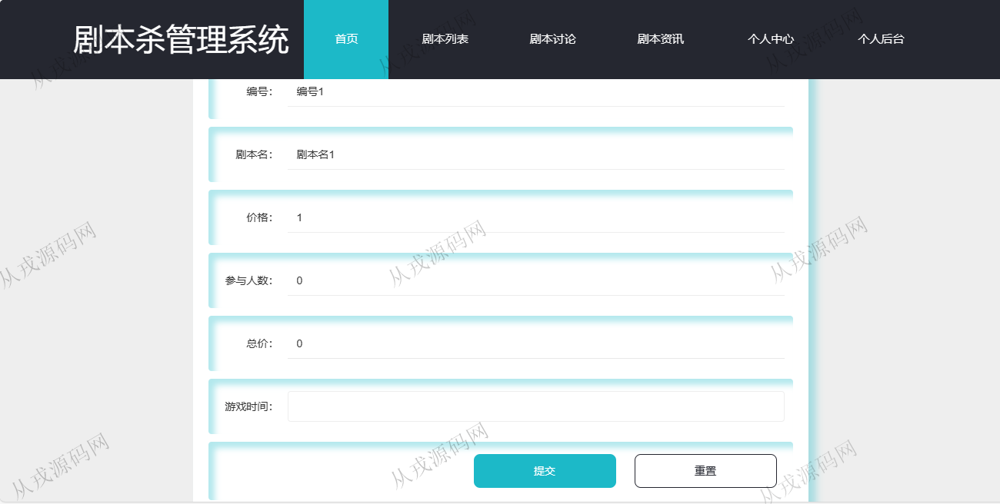
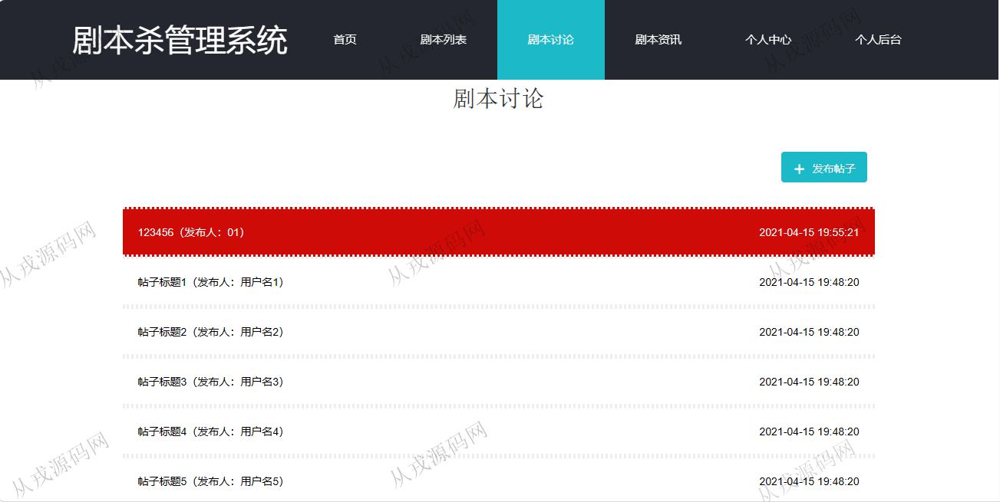
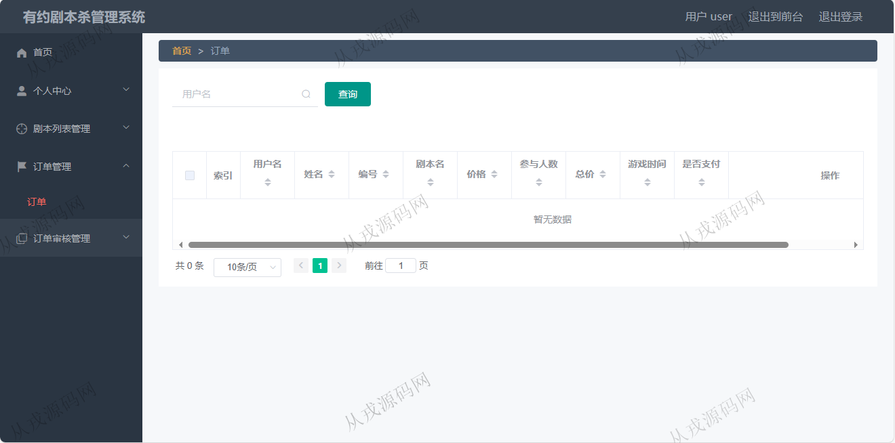
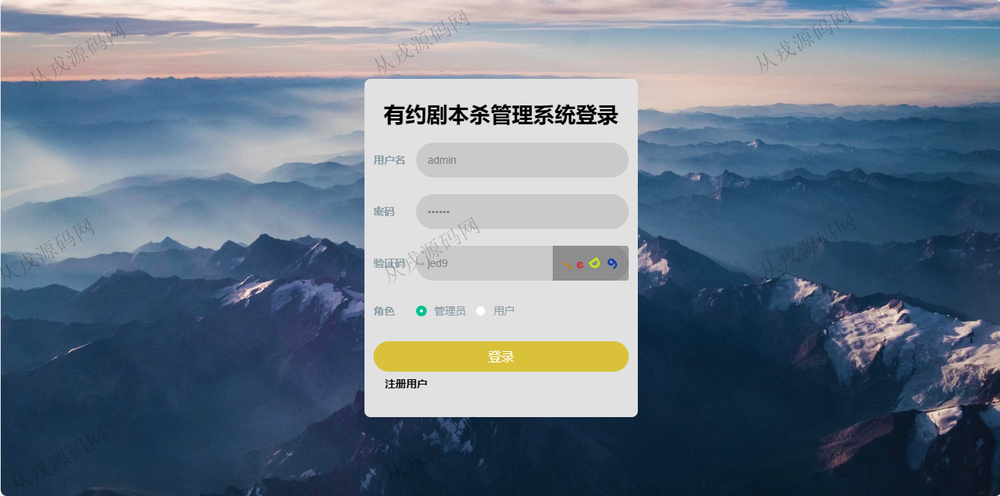
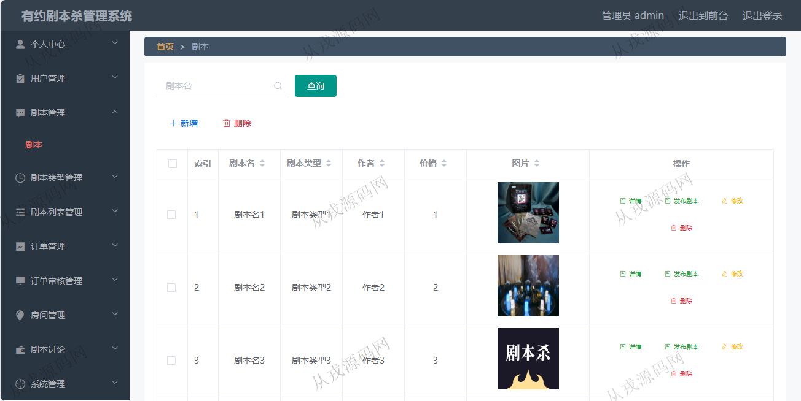

<h1 align="center">124.有约剧本杀管理系统</h1>

 获取sql文件 QQ: 386869957 QQ群: 377586148 

 [推荐站点: 从戎源码网](https://armycodes.com/) 

## 简介

> 本代码来源于网络,仅供学习参考使用!
>
> 提供1.远程部署/2.修改代码/3.设计文档指导/4.框架代码讲解等服务
> 
> 用户端访问地址：http://localhost:8080/springbootx0gy2/front/index.html
>
> 用户：user 123456
> 
> 管理后台访问地址：http://localhost:8080/springbootx0gy2/admin/dist/index.html#/index
>
> 管理员: admin 123456
> 

## 项目介绍
基于springboot的有约剧本杀管理系统：前端 vue、elementui，后端 maven、springmvc、spring、mybatis，角色分为管理员、用户号；集成剧本下单、剧本讨论、剧本资讯等功能于一体的系统。

## 功能介绍

### 用户

- 基本功能：登录、注册、退出
- 网站首页：主导航栏，轮播图，剧本资讯
- 剧本：剧本列表展示，剧本详情，剧本下单
- 剧本讨论：帖子列表，发布新贴
- 剧本资讯：资讯列表，资讯详情
- 个人中心：用户信息查看与修改，我的发布列表

### 管理员

- 用户管理：用户信息的增删改查
- 剧本管理：剧本信息的增删改查，图片上传，发布剧本
- 剧本类型管理：剧本类型的增删改查
- 订单管理：用户在前台下单，后台管理员查看订单信息，审核，删除
- 房间管理：房间信息的增删改查
- 剧本讨论：用户在前台发布讨论帖子，后台管理员可以进行查看，修改，和删除
- 剧本资讯：资讯信息的增删改查
- 轮播图管理：轮播图列表查询，查看详情，删除

## 环境

- <b>IntelliJ IDEA 2021.3</b>

- <b>Mysql 5.7.26</b>

- <b>JDK 1.8</b>

- <b>node 14.14.0</b>

## 运行截图

